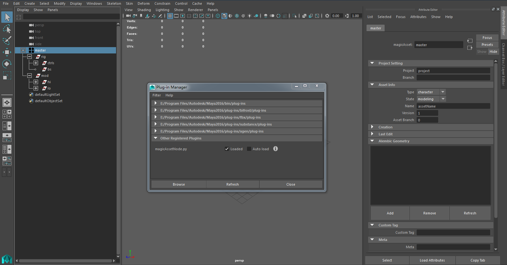

# Magic Asset Node

---


Maya custom node used to control asset infomation.

---


#### MAYA NODE ID
* Node ID : 0x101113
* Transform Matrix ID : 0x101114


#### INSTALLATION

1. Download the latest release and unzip the folder where you want to live.
2. Copy icon file "out_magicAsset.png" into `%USERPROFILE%\Documents\maya\mayaVersion\prefs\icons`
3. Copy AETemplate file "AEmagicAssetTemplate.py" into `%USERPROFILE%\Documents\maya\mayaVersion\prefs\scripts`
4. Copy Plugin file "magicAsset.py" into you maya's plugins folder.
5. Load plugin in maya, run these commands in Python to create magic node.

```python
import maya.cmds as cmds
cmds.createNode("magicAsset")
```
